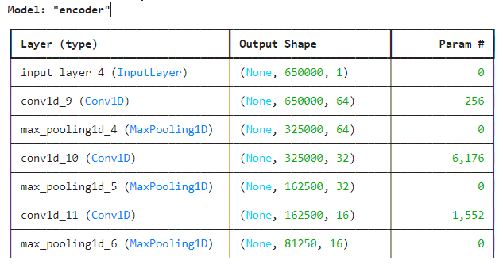
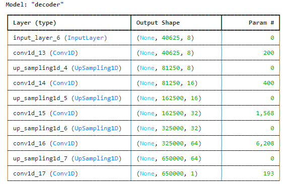

# Denoiser Model for ECG Signal

## 1. Autoencoder-based denoiser model

#### Model architecture

.png>)

1. **Encoder**: 
    - A series of 1D convolutional layers followed by max-pooling layers.
    - Extracts features from the input ECG signal.

2. **Bottleneck**: 
    - A single 1D convolutional layer followed by max-pooling.
    - Compresses the encoded features into a lower-dimensional space.

3. **Decoder**: 
    - A series of 1D convolutional layers followed by upsampling layers.
    - Reconstructs the denoised signal from the compressed features.

This project includes a folder named Denoising_CNN_based_autoencoders, which contains all the necessary files for training the model. If you need to retrain the model, simply clone this folder and run the main.py script.

The trained model is already provided and can be found at Model\denoising_autoencoder_cnn.h5.

